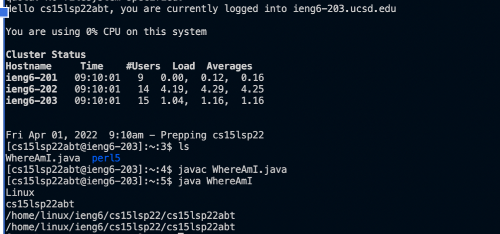

# Lab report One 
## 1. Installing VScode

It's simple, just go to the [website](https://code.visualstudio.com/) and download it. And after you succssfully download it you should see a screen like this **below**.

## 2. Remotely Connecting
For MAC computers, you look up your course specific account [here](https://sdacs.ucsd.edu/~icc/index.php). Then you change the passwords and go to the terminal on your MAC. The next step is type something like 

⤇ ssh cs15lsp22zz@ieng6.ucsd.edu

in the terminal, put in password and you're done. 

You should get a result like this:

## 3. Trying Some Commands
There are many useful commands you can use. Like:

cd ~

cd

ls -lat

ls -a

Successfully doing so would result in 

## 4. Moving Files with scp
For this step you create a class called WhereAmI.java. Then in the terminal you type in

scp WhereAmI.java cs15lsp22zz@ieng6.ucsd.edu:~/

Then log into it again and use ls. That should do it. 

## 5. Setting an SSH Key
For this part you must be on your own computer, type exit to log out. Then you type ssh-keygen and press Enter for everything next until you finish setting up an empty passphrase. Then you log in, use your passcode, and type mkdir .ssh, then you exit and follow the step below.

## 6.Optimizing Remote Running
Here we are for the last step. You can access it by simply typing the command below. 

It will directly run on the remove server. Then it will exit the server.
