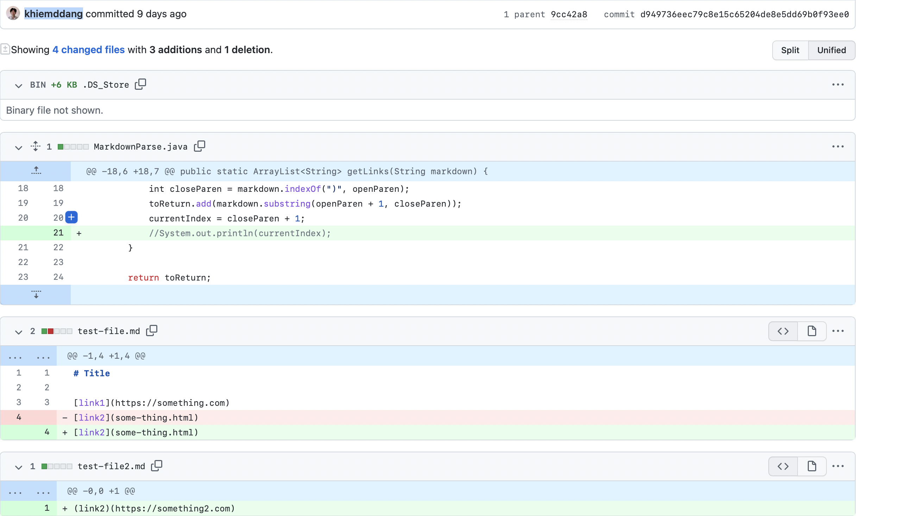
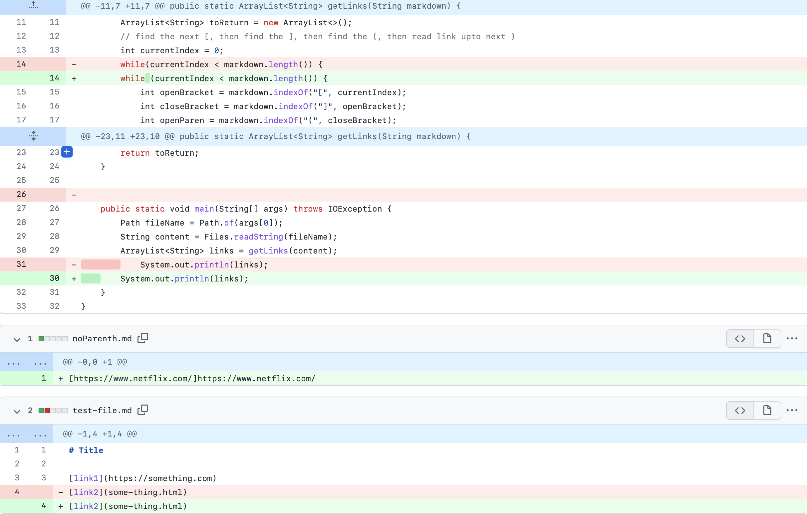
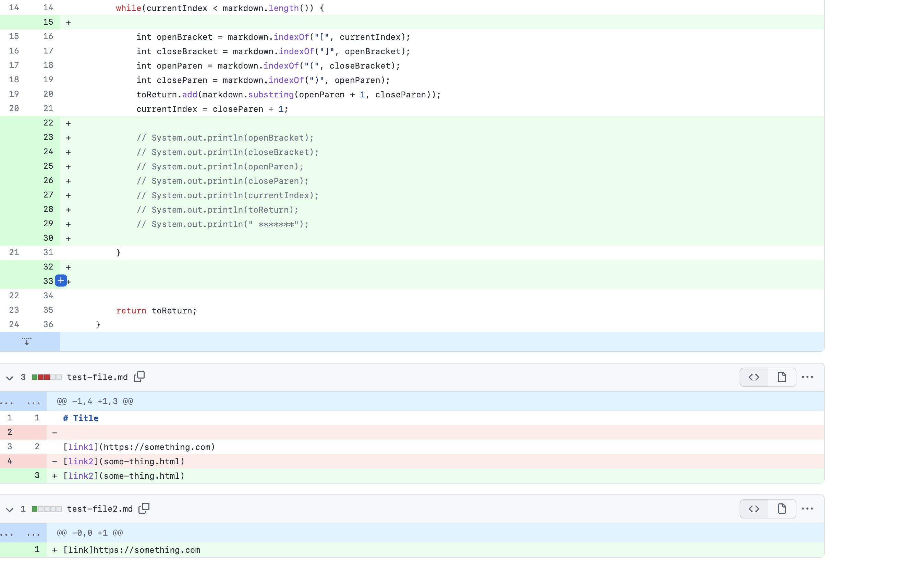

# Lab report two

##Code Change One


[Here](https://github.com/khiemddang/markdown-parser/blob/main/test-file2.md)

This generate an infinite loop. As you can see there are 4 brackets in the test file, but the previous code just keep searching for the end of it. In the input below you can see it generates a OutOfMemoryError.

```
Exception in thread "main" java.lang.OutOfMemoryError: Java heap space
at java.base/java.util.Arrays.copyOf(Arrays.java:3512)
at java.base/java.util.Arrays.copyOf(Arrays.java:3481)
at java.base/java.util.ArrayList.grow(ArrayList.java:237)
at java.base/java.util.ArrayList.grow(ArrayList.java:244)
at java.base/java.util.ArrayList.add(ArrayList.java:454)
at java.base/java.util.ArrayList.add(ArrayList.java:467)
at MarkdownParse.getLinks(MarkdownParse.java:25)
at MarkdownParse.main(MarkdownParse.java:37)
```

##Code Change Two


[Here](https://github.com/peds24/markdown-parser/blob/main/test-file2.md)

We can see this results a StringIndexOutOfBoundsException. As you can see in the text file, there is no brackets in the first link, so it just keeps searching for one and repeating until it's out of bound, creating another infinite loop.


```
Exception in thread "main" java.lang.StringIndexOutOfBoundsException: Range [0, -1) out of bounds for length 50 at java.base/jdk.internal.util.Preconditions$1.apply(Preconditions.java:55)
        at java.base/jdk.internal.util.Preconditions$1.apply(Preconditions.java:52)
        at java.base/jdk.internal.util.Preconditions$4.apply(Preconditions.java:213)
        at java.base/jdk.internal.util.Preconditions$4.apply(Preconditions.java:210)
        at java.base/jdk.internal.util.Preconditions.outOfBounds(Preconditions.java:98)
        at java.base/jdk.internal.util.Preconditions.outOfBoundsCheckFromToIndex(Preconditions.java:112)
        at java.base/jdk.internal.util.Preconditions.checkFromToIndex(Preconditions.java:349)
        at java.base/java.lang.String.checkBoundsBeginEnd(String.java:4589)
        at java.base/java.lang.String.substring(String.java:2703)
        at MarkdownParse.getLinks(MarkdownParse.java:19)
        at MarkdownParse.main(MarkdownParse.java:29)
```


##Code Change Three


[Here](https://github.com/NxlinJxshi/markdown-parser/blob/main/test-file2.md)


This is another StringIndexOutOfBoundsException with a different kind of test file. There is no bracket so it just keep searching it and create an infinite loop.


```
Exception in thread "main" java.lang.StringIndexOutOfBoundsException: begin 0, end -1, length 27
```