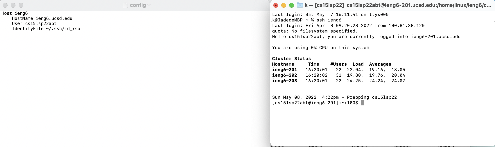
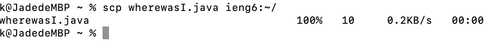
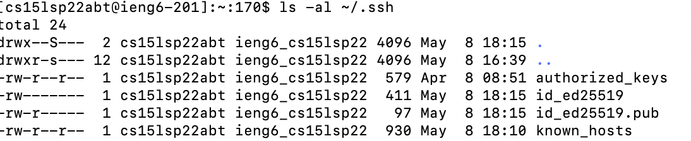
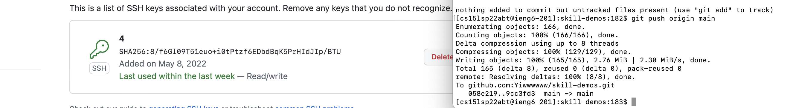

# Lab report two

##Streamlining ssh Configuration

This is my .ssh/config file. In order to create such file, I went
```
~/.ssh/config
```
first.

Then I open it by hand in my personal folder, then add those code into it
```
Host ieng6
    HostName ieng6.ucsd.edu
    User cs15lsp22abt
    IdentityFile ~/.ssh/id_rsa
```
Until it become like this.

And above is also the ssh command that I used for logging in.

Also this is how scp copying the file goes using just the alias I chose. 


##Setup Github Access from ieng6

This is where the public and private key I made is stored in my user account. The public one does have a .pub.

And this is where it was uploaded on github and the right is the git commands to commit and push a change to Github while logged into my ieng6 account.

[resulting commit](https://github.com/Yiwwwwww/skill-demos/commit/729d50f0a1920cdcfd8f5ed5b50b11f096795a48)


##Copy whole directories with scp -r
Show copying your whole markdown-parse directory to your ieng6 account.
Show logging into your ieng6 account after doing this and compiling and running the tests for your repository.
Show (like in the last step of the first lab) combining scp, ;, and ssh to copy the whole directory and run the tests in one line.
