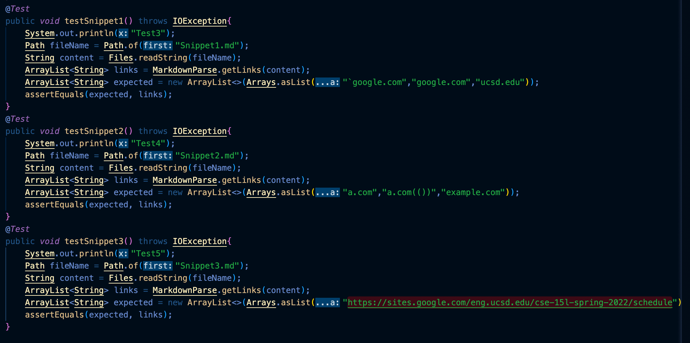
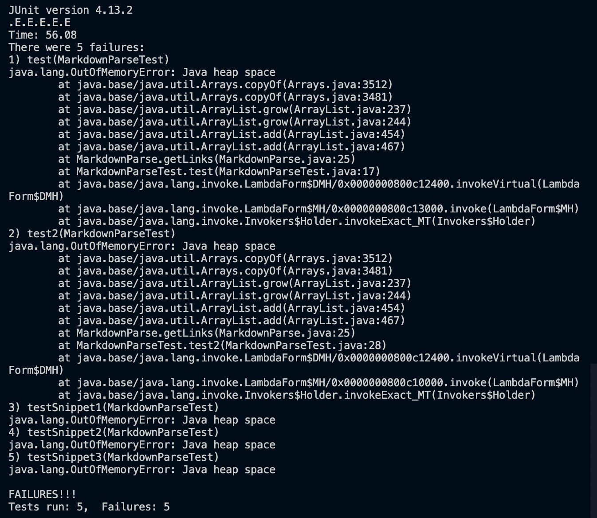
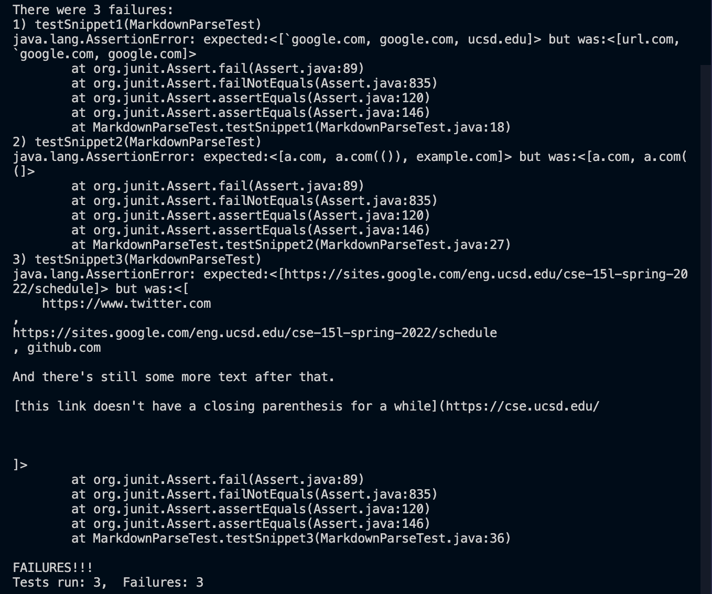

# Lab report four

Link for both repository

My own repository:
[Yiwwwwww](https://github.com/Yiwwwwww/markdown-parser.git)

Tyann Dang's repository:
[TuannDang](https://github.com/TuannDang/markdown-parser)

## Expected output for all the snippers
------------------
## Snipper 1

```
`google.com, google.com, ucsd.edu
```
-------------
## Snipper 2
```
a.com,a.com(()),example.com
```
--------------
## Snipper 3
```
https://sites.google.com/eng.ucsd.edu/cse-15l-spring-2022/schedule
```

General 3 tests that I used for both repository


# Test for my repository
Did not pass. All of them failed. :(


# Test for Tyann Dang's repository


------------------------

# Question
1. 
I would check if the code consists of two backticks. If so, the program will ignore the backticks by replacing all of them with empty space like " ".

2. I feel like <10 lines are not enough here, I would suggest more which sensor how pany pairs of parentheses, brackets, and escaped brackets there are and provide the link between them.
3. Yes, the small code change works. The code will check for the new lines in brackets and parentheses with while loop.