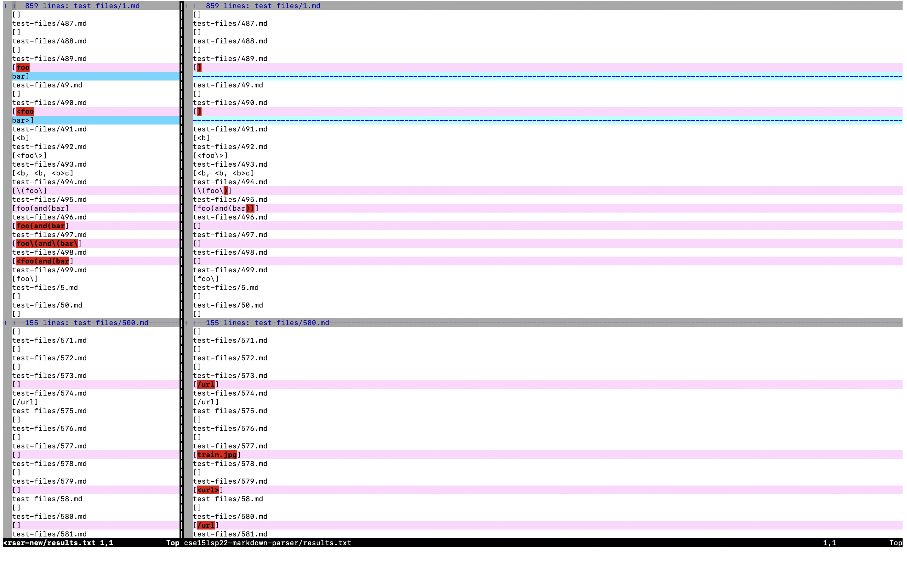
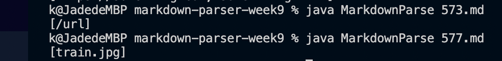
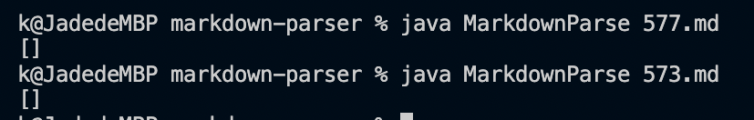
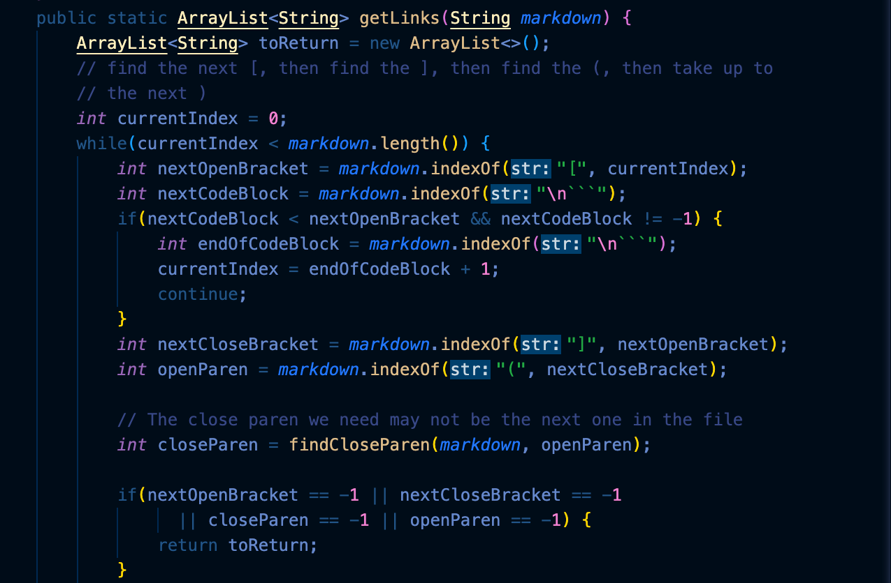

# Lab report five

For this lab, I used vimdiff on the results of running a bash for loop. Where it looks exactly like this.

## Running from the command line
This is not my implication:

This is mine implication:

## Test 573
[test link for 573](https://github.com/nidhidhamnani/markdown-parser/blob/8dd87e6914ae40a4321aac8e2483e349de40b03c/test-files/573.html.test)

For the test file itself, we should not expect any link in there. But as you can see from this screenshot from vimdiff, the recent code provides a url for it. So mine implication is correct!

## Test 577
[test link for 577](https://github.com/nidhidhamnani/markdown-parser/blob/8dd87e6914ae40a4321aac8e2483e349de40b03c/test-files/577.html.test)

For the test file itself, we should not expect any link in there. But as you can see from this screenshot from vimdiff, the recent code provides a url for it. So mine implication is correct :)

## Problem with both of them

They all have the same problem in the code. Which is 

in this method. 

For test 573, the code didn't provide an option for "!", which means an image file. With image file like that it can't consist a normal link.

Test 577 looks like a normal image file, which shouldn't be represented as a link. In the actual code it doesn't sensor the "!" but continue to reture whatever they had inside the (), which caused the problem.

Therefore the only way to fix the code is to add a statement which automatically reture null when there's "!" presented.